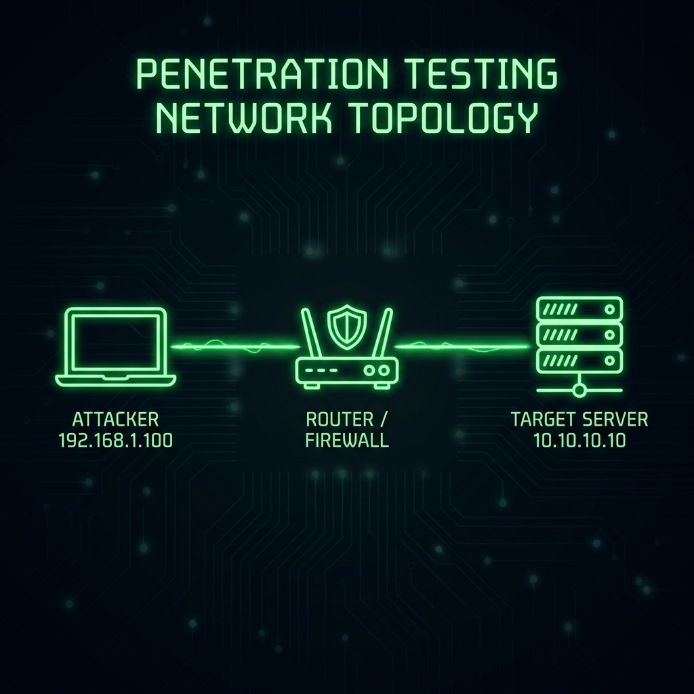

## Pendahuluan

Python adalah bahasa pemrograman yang wajib dikuasai oleh setiap hacker. Library-nya yang kaya membuat kita bisa membuat tools exploitasi, scanner, dan automation dengan sangat cepat.

Dalam tutorial ini, kita akan membahas cara setup environment yang benar agar tidak merusak sistem operasi utama kamu.

## Mengapa Virtual Environment Itu Penting?

Jangan pernah menginstall paket python global dengan `sudo pip install`! Itu bisa merusak dependensi sistem linux kamu. Solusinya adalah **Virtual Environment**.

### Cara Membuat Virtual Environment

Gunakan perintah `venv` bawaan Python 3:

```bash
# Install paket venv jika belum ada
sudo apt install python3-venv

# Buat folder project
mkdir tools-hacking
cd tools-hacking

# Buat virtual environment bernama 'env'
python3 -m venv env

# Aktifkan environment
source env/bin/activate
```

Setelah aktif, prompt terminal kamu akan berubah ada tanda `(env)`.

## Install Tools Wajib

Berikut adalah daftar library yang "Wajib Fardu 'Ain" untuk diinstall:

```bash
pip install requests scapy pwntools beautifulsoup4
```

*   **Requests**: Untuk HTTP request (Web Hacking).
*   **Scapy**: Untuk manipulasi paket jaringan (Network Hacking).
*   **Pwntools**: Framework CTF untuk Binary Exploitation.

## Contoh Script Sederhana

Mari kita coba buat port scanner sederhana menggunakan Python.

```python
import socket

target = "127.0.0.1"

def scan_port(port):
    s = socket.socket(socket.AF_INET, socket.SOCK_STREAM)
    s.settimeout(1)
    result = s.connect_ex((target, port))
    if result == 0:
        print(f"Port {port} is OPEN")
    s.close()

for port in [21, 22, 80, 443]:
    scan_port(port)
```

Simpan script di atas sebagai `scanner.py` dan jalankan!

## Kesimpulan

Setup yang benar adalah langkah awal menjadi profesional. Jangan malas untuk membuat environment terisolasi untuk setiap project tools kamu. Safe Hacking!
